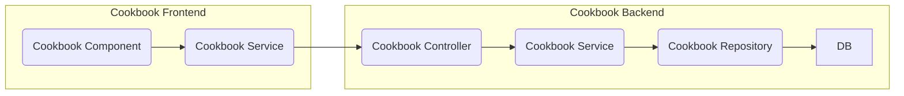

# test-what-matters

This project is a study on testing methodologies. 

This project is a cookbook website.

```mermaid
flowchart LR
    
    subgraph Cookbook Frontend 
        FA(Cookbook Component) --> FB(Cookbook Service)

    end 
    subgraph Cookbook Backend 

    BA(Cookbook Controller) --> BB(Cookbook Service)
    BB --> BC(Cookbook Repository)
    BC --> BD[DB]
    end

    FB --> BA

```
