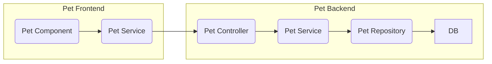

# test-what-matters

```mermaid
flowchart LR
    
    subgraph Pet Frontend 
        FA(Pet Component) --> FB(Pet Service)

    end 
    subgraph Pet Backend 

    A(Pet Controller) --> B(Pet Service)
    B --> C(Pet Repository)
    C --> D[DB]
    end

    FB --> A

```
